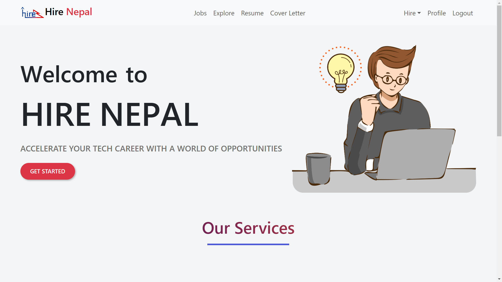
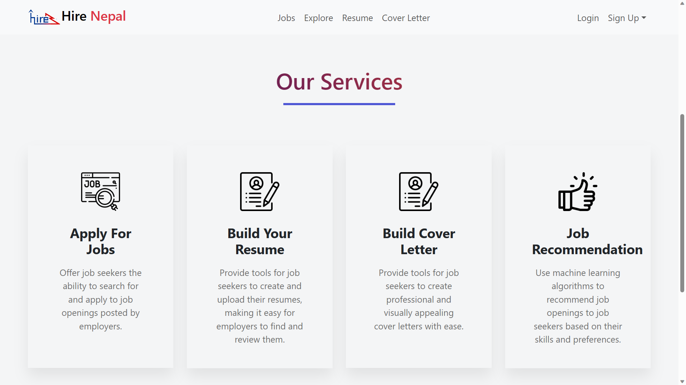
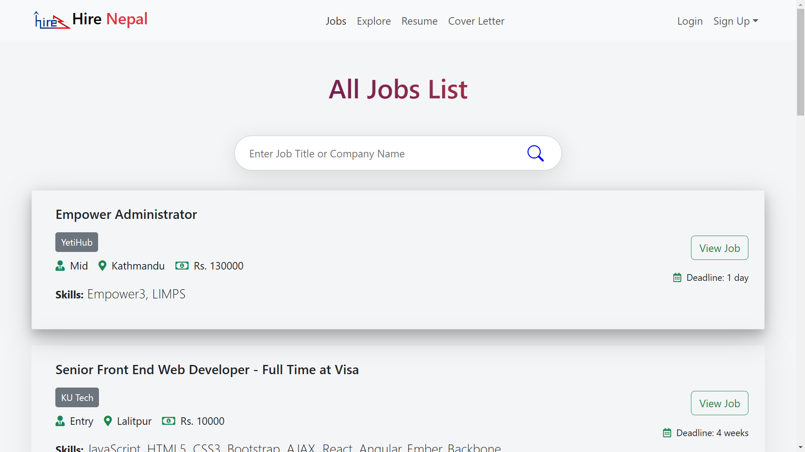
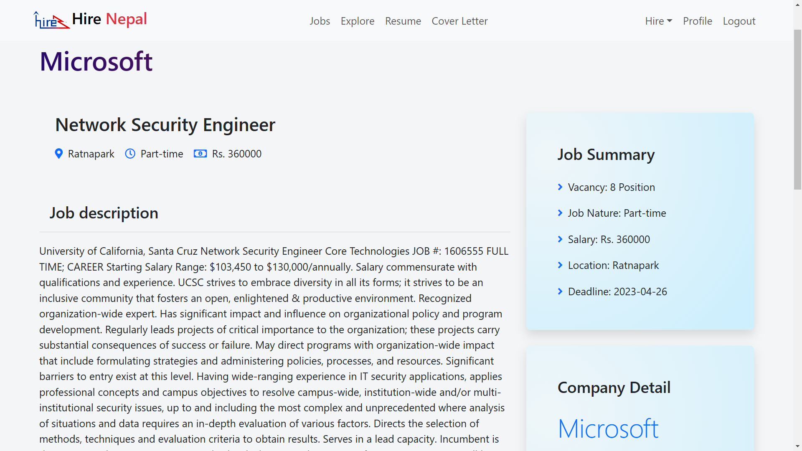
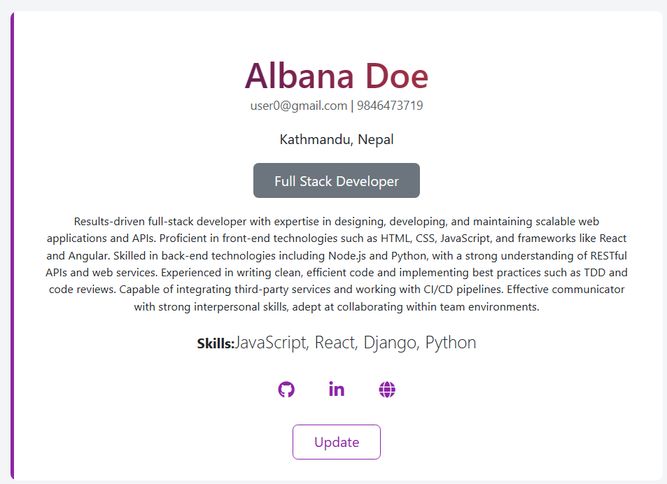
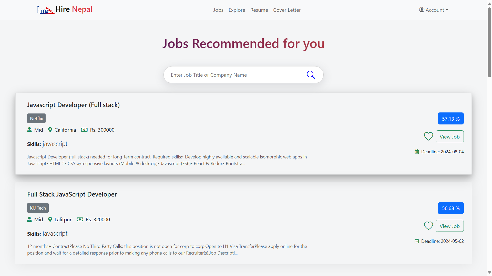
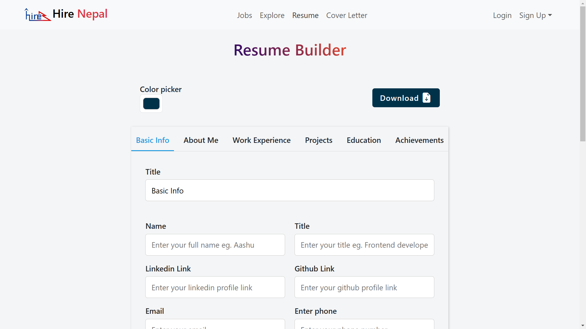
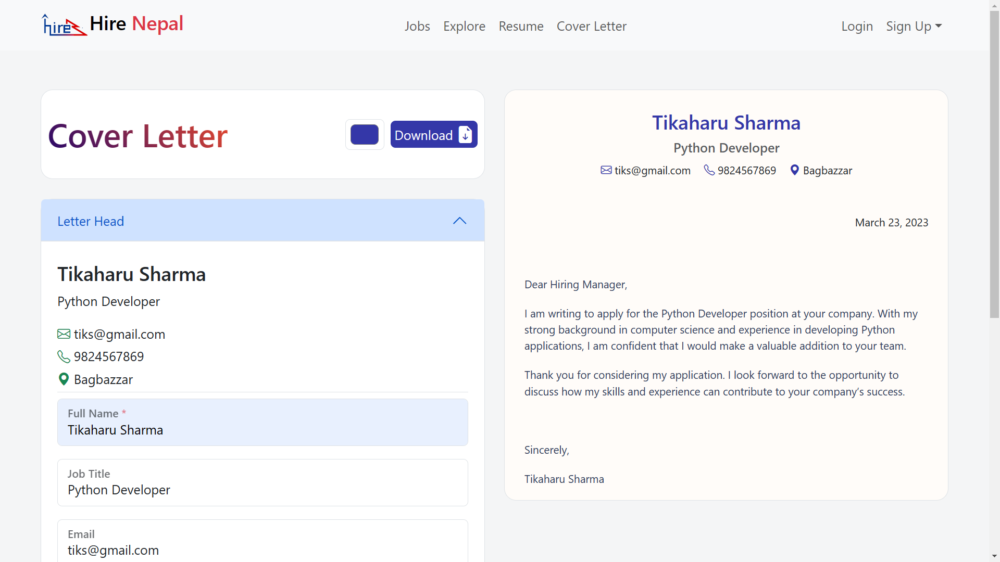
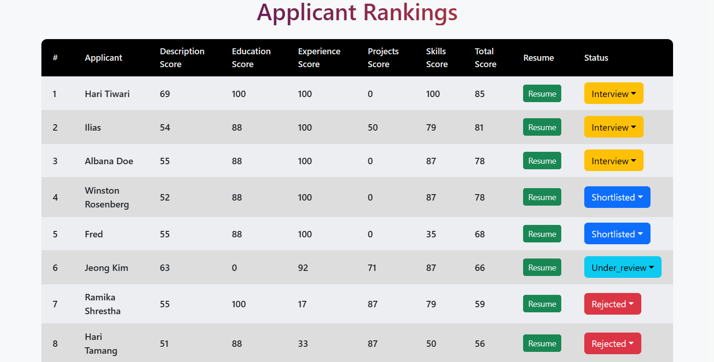
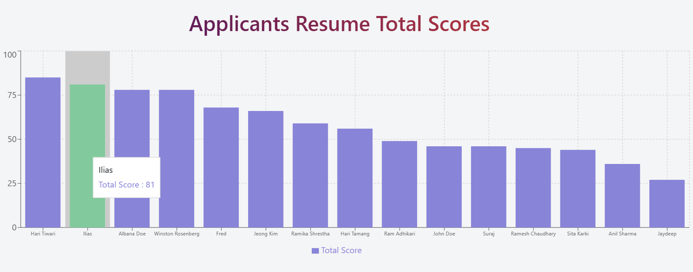

# Hire Nepal

A Job Portal Website that connects job seekers with employers. It includes NLP powered Job Matching and Applicant Ranking System.

## Features
### Employer Perspective
- **Automated Resume Parsing and Ranking**: The Applicant Ranking System (ARS) parses resumes in PDF format, extracts key information, and ranks candidates based on weighted criteria set by employers, reducing the time and potential bias of manual screening.

- Employer Dashboard: Manage your job postings and applicants from a single platform.
- Applicant Tracking: Track the status of each application during your hiring process.

### Seeker Perspective
- **Intelligent Job Matching**: The system analyzes user profiles and skills to provide job seekers with personalized recommendations for relevant job openings.
- Job Listings: Browse through the latest job postings from top companies in Nepal.
- Easy Apply: Apply for a job with just a few clicks.
- Resume Generator: Generate a professional resume tailored to the job you are applying for.
- Cover Letter Generator: Generate a personalized cover letter to accompany your resume.

## Technologies Used
- **Front-end:** React.js
- **Back-end:** Django REST Framework, PyMuPDF
- **NLP:** spaCy, Sentence Transformers

## Project Setup

To run this app locally, clone this repo and install the dependencies.

```bash
git clone https://github.com/The-SP/Job-Portal-Frontend.git
cd Job-Portal-Frontend
npm install
```

## Backend

[Backend Repo Link](https://github.com/The-SP/Job-Portal-Backend)  
You can use the link above to access the code for the backend api of the project.

## Screenshots

<table>
  <tr>
    <td>Homepage</td>
    <td>Services</td>
  </tr>
  <tr>
    <td></td>
    <td></td>
  </tr>
  <tr>
    <td>Job List</td>
    <td>Job Detail</td>
  </tr>
  <tr>
    <td></td>
    <td></td>
  </tr>
  <tr>
    <td>Profile</td>
    <td>Job Recommendation</td>
  </tr>
  <tr>
    <td></td>
    <td></td>
  </tr>
  <tr>
    <td>Resume Builder</td>
    <td>Cover Letter Builder</td>
  </tr>
  <tr>
    <td></td>
    <td></td>
  </tr>
  <tr>
    <td>Applicant Ranking</td>
    <td>Ranking Visualization</td>
  </tr>
  <tr>
    <td></td>
    <td></td>
  </tr>
</table>
